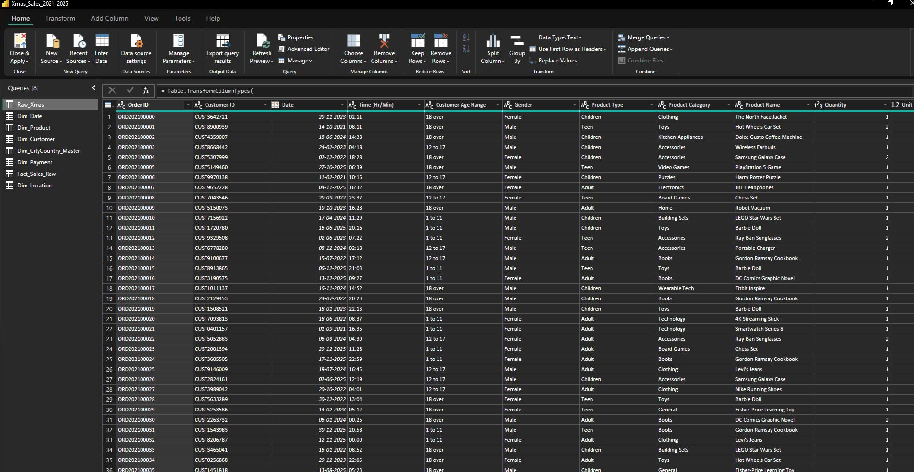
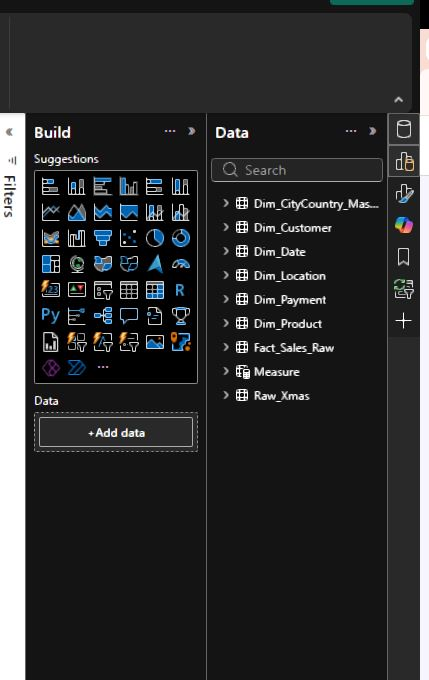
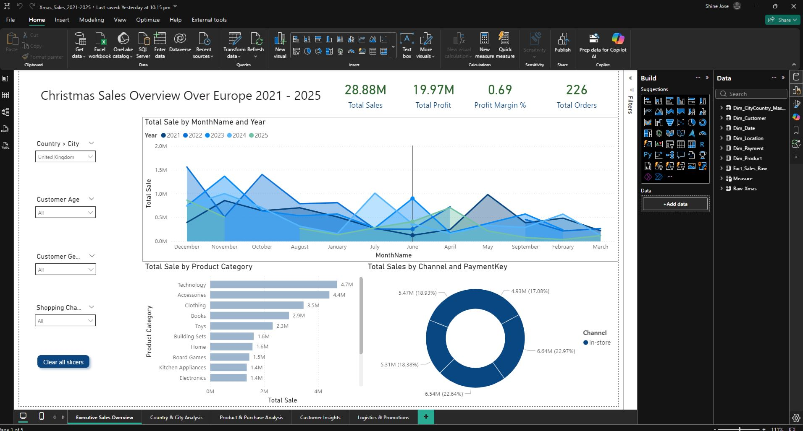
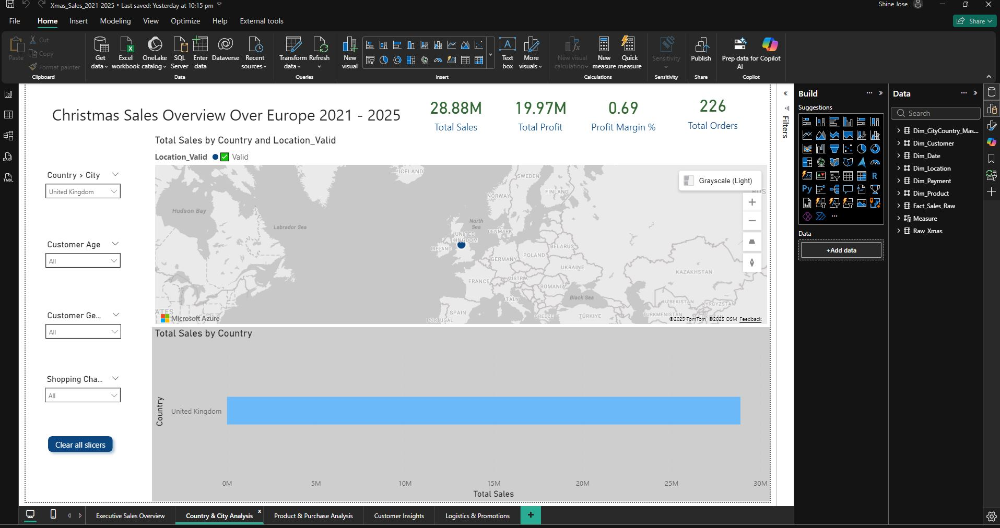
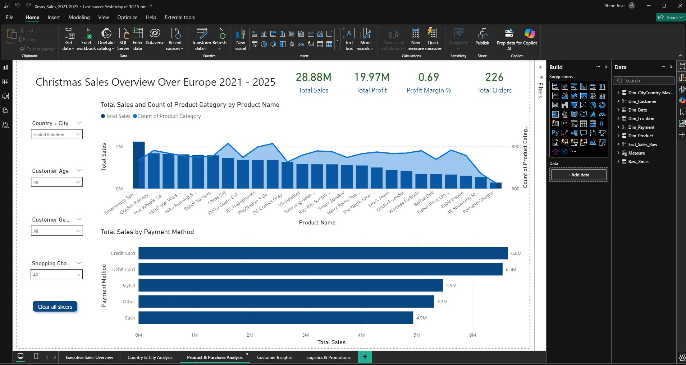
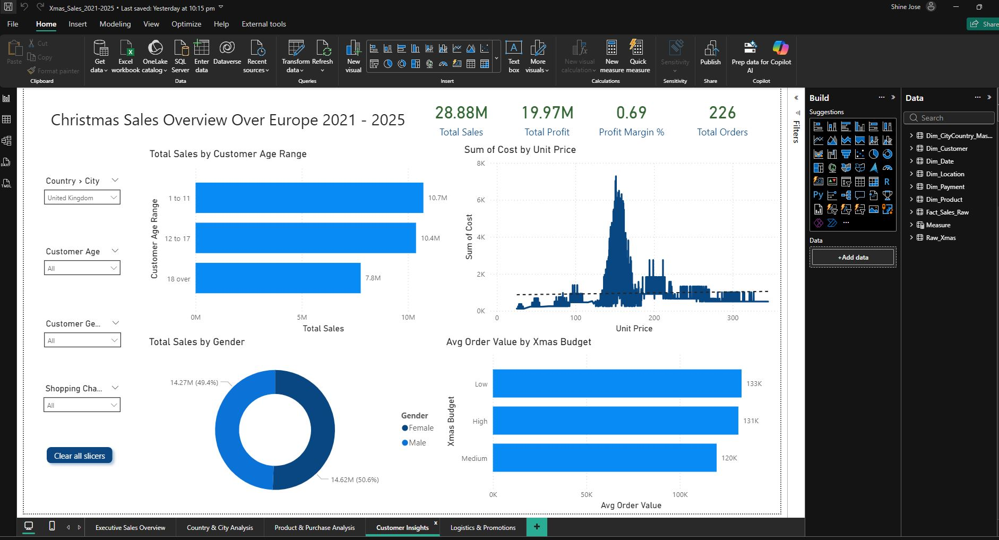
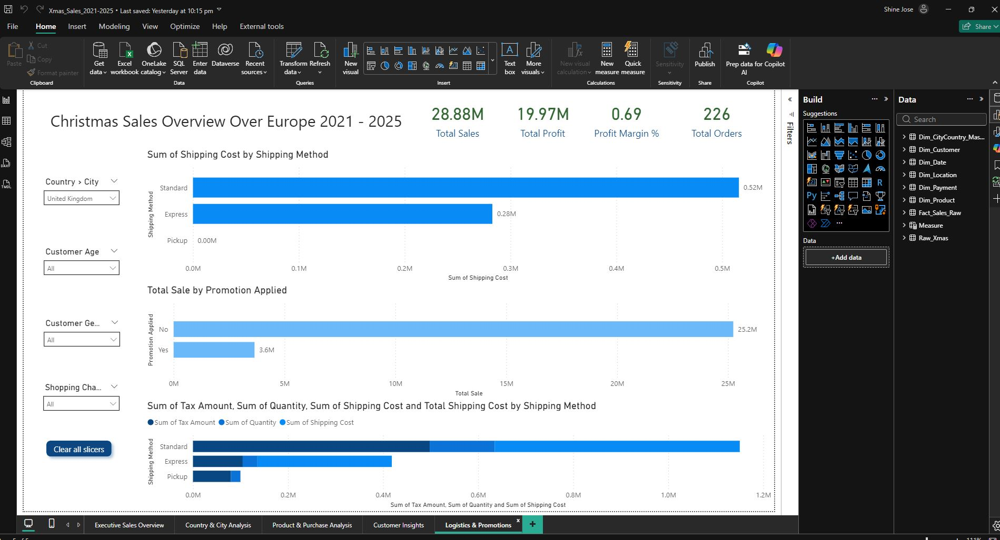

# Power BI — Xmas Sales Analytics (2021–2025)

> **Repository:** PowerBI-Xmas-Sales-Project

This README is a step‑by‑step guide to reproduce the Power BI project using the synthetic **Xmas Sales Dataset (2021–2025)**. It contains detailed instructions for data ingestion, Power Query transformations, data modelling (star schema), DAX measures, visualization design, deployment to Power BI Service, and useful tips for performance and governance.

---

## Table of Contents

1. Project overview
2. Files in this repository
3. Prerequisites
4. Folder / repo structure
5. Dataset description
6. Step-by-step: Prepare your environment
7. Step-by-step: Import & Transform (Power Query)
8. Step-by-step: Build Dimensions & Fact (Star Schema)
9. Step-by-step: Relationships & Model view
10. Step-by-step: Create DAX measures (copy/paste)
11. Step-by-step: Visualization pages — exactly what to build
12. Step-by-step: Slicers, interactions and bookmarks
13. Performance & modelling best practices
14. Deployment: Publish, dataset refresh, and access
15. Troubleshooting common issues
16. Extensions & advanced ideas
17. License & contact

---

# 1. Project overview

A multi-page Power BI report that analyses sales between **2021 and 2025**. The dataset contains orders, customers, products, shipping, tax and promotional details. The report demonstrates Power Query transformations, a clean star schema, time intelligence and business KPIs useful for interviews and production dashboards.

# 2. Files in this repository

* `/data/xmas_dataset_2021_2025.zip` – Zip containing `xmas_dataset_2021_2025.csv` and `xmas_dataset_2021_2025.xlsx` (20k rows). (Place the file here.)
* `/powerbi/` – (optional) recommended place to store the final `.pbix` file.
* `README.md` – This file.
* `/docs/` – Optional: screenshots, mockups and exported visuals.

# 3. Prerequisites

* Power BI Desktop (Latest version recommended)
* Basic familiarity with Power Query and DAX
* Optional: Power BI Pro or Premium to publish + schedule refresh
* If using gateway for on-prem files: On-premises data gateway installed and configured

# 4. Folder / repo structure

```
PowerBI-Xmas-Sales-Project/
├─ data/
│  └─ xmas_dataset_2021_2025.zip
├─ powerbi/
│  └─ Xmas_Sales_Report.pbix
├─ docs/
│  └─ screenshots.md
└─ README.md
```

# 5. Dataset description

Primary columns (in CSV/XLSX):

* Order ID, Customer ID, Date, Time (Hr/Min)
* Customer Age Range, Gender
* Product Type, Product Category, Product Name
* Quantity, Unit Price, Tax Amount, Unit Cost, Cost
* Shipping Method, Shipping Cost
* Total Sales, Profit
* Purchase Type, Channel (Online/In-store)
* Country, City
* Xmas Budget, Payment Method, Promotion Applied

Notes:

* `Total Sales` includes (Unit Price * Quantity) + Tax Amount + Shipping Cost.
* `Profit` is `Total Sales - Cost` for synthetic data.

# 6. Step-by-step: Prepare your environment

1. Unzip `/data/xmas_dataset_2021_2025.zip` into the `data/` folder.
2. Open Power BI Desktop.
3. On the start screen: **Get data → Text/CSV** (or Excel if you prefer the `.xlsx`).
4. Select `xmas_dataset_2021_2025.csv` and click **Transform Data** (this opens Power Query Editor).

# 7. Step-by-step: Import & Transform (Power Query)

Below are the exact changes to make in Power Query. Each numbered step is actionable.

**7.1 Inspect & Fix data types**

* Select the main query (usually `xmas_dataset_2021_2025` or `Table1`).
* Verify types and set them:

  * `Date` → Date
  * `Time (Hr/Min)` → Text
  * `Quantity` → Whole Number
  * `Unit Price`, `Tax Amount`, `Unit Cost`, `Cost`, `Shipping Cost`, `Total Sales`, `Profit` → Decimal Number
  * `Order ID`, `Customer ID` → Text

Use the **Transform → Detect Data Type** if unsure but always confirm manually.

**7.2 Trim & Clean text fields**

* Select all text columns → Transform → Format → Trim.
* Transform → Format → Clean (removes non-printable characters).

**7.3 Fix date parsing issues**

* If `Date` imported as text, select column → Transform → Date → Using Locale (choose `English (United States)` or the format that matches).

**7.4 Split / normalize columns if needed**

* If `Time (Hr/Min)` needs splitting, duplicate the column and extract hour/minute using `Split Column → By Delimiter (:)`.

**7.5 Remove duplicates & unnecessary columns**

* If the raw file contains unneeded columns, remove them now.
* Do NOT remove `Order ID` as it's useful for counting orders.

**7.6 Create calculated columns in Query if useful**

* Example: `SalesExTax = [Unit Price] * [Quantity]`

  * Add Column → Custom Column → `SalesExTax = [Unit Price] * [Quantity]`
* Example: `EffectiveMargin = ([Unit Price] - [Unit Cost]) / [Unit Price]`

**7.7 Create separate queries for dimension tables**
We will create the dimension tables inside Power Query to ensure clean lookup tables and to avoid duplicates.

# 8. Step-by-step: Build Dimensions & Fact (Star Schema)

Create these queries (each one based on the main table using `Reference` not `Duplicate` where appropriate).

**8.1 Fact_Sales**

* Right click main query → Reference → Rename to `Fact_Sales`.
* Keep all columns required for metrics: `Order ID`, `Customer ID`, `Date`, `Product Name`, `Quantity`, `Unit Price`, `Tax Amount`, `Shipping Cost`, `Total Sales`, `Profit`, `Purchase Type`, `Channel`, `Payment Method`, `Promotion Applied`, etc.
* Apply correct data types again.

**8.2 Dim_Date (canonical date table)**

* Home → New Source → Blank Query → rename to `Dim_Date`.
* Advanced Editor: paste the code below (this generates continuous dates 2021-01-01 → 2025-12-31):

```powerquery
let
  StartDate = #date(2021,1,1),
  EndDate = #date(2025,12,31),
  Dates = List.Dates(StartDate, Duration.Days(EndDate - StartDate) + 1, #duration(1,0,0,0)),
  DateKey = Date.ToText([Date],"yyyyMMdd"),
  TableFromList = Table.FromList(Dates, Splitter.SplitByNothing(), {"Date"}),
  AddYear = Table.AddColumn(TableFromList, "Year", each Date.Year([Date])),
  AddMonth = Table.AddColumn(AddYear, "Month", each Date.Month([Date])),
  AddMonthName = Table.AddColumn(AddMonth, "MonthName", each Date.ToText([Date],"MMMM")),
  AddDay = Table.AddColumn(AddMonthName, "Day", each Date.Day([Date])),
  AddQuarter = Table.AddColumn(AddDay, "Quarter", each "Q" & Number.ToText(Date.QuarterOfYear([Date]))),
  AddDateKey = Table.AddColumn(AddQuarter, "DateKey", each Date.ToText([Date],"yyyyMMdd")),
  Reordered = Table.ReorderColumns(AddDateKey, {"Date","DateKey","Year","Quarter","Month","MonthName","Day"})
in
  Reordered
```

* Close & Apply (we will finalize relationships later).

**8.3 Dim_Product**

* Reference `Fact_Sales`, remove columns except `Product Name`, `Product Category`, `Product Type`.
* Remove duplicates -> Home → Remove Rows → Remove Duplicates.
* Rename to `Dim_Product`.

**8.4 Dim_Customer**

* Reference `Fact_Sales`, keep `Customer ID`, `Customer Age Range`, `Gender`, `Xmas Budget`, `Country`, `City`, etc.
* Remove duplicates.
* Rename to `Dim_Customer`.

**8.5 Dim_Location** (if useful)

* Reference `Fact_Sales`, keep `Country`, `City`.
* Remove duplicates.
* Add a column if you want ISO codes (manually or via mapping table).

# 9. Step-by-step: Relationships & Model view

1. Close & Apply to load queries to the model.
2. Navigate to **Model** view.
3. Set these relationships (drag one column to the other):

   * `Fact_Sales[Date]` -> `Dim_Date[Date]` (Many to One)
   * `Fact_Sales[Product Name]` -> `Dim_Product[Product Name]` (Many to One)
   * `Fact_Sales[Customer ID]` -> `Dim_Customer[Customer ID]` (Many to One)
   * `Fact_Sales[Country]` -> `Dim_Location[Country]` (Many to One) — optional
4. Ensure cross filter direction is `Single` from dimension to fact (default). For time intelligence, keep `Dim_Date` → `Fact_Sales` direction.
5. Set `Dim_Date[Date]` as a Date table: **Mark as Date Table → Date column**.

# 10. Step-by-step: Create DAX measures (copy & paste)

Create these measures in `Fact_Sales` or a dedicated `Measures` table (recommended: create a disconnected table `Meta_Measures` to store measures).

**10.1 Sales & Volume**

```DAX
Total Sales = SUM(Fact_Sales[Total Sales])
Total Quantity = SUM(Fact_Sales[Quantity])
Total Cost = SUM(Fact_Sales[Cost])
Total Profit = SUM(Fact_Sales[Profit])
```

**10.2 Basic KPIs & Ratios**

```DAX
Profit Margin % = DIVIDE([Total Profit], [Total Sales], 0)
Total Orders = DISTINCTCOUNT(Fact_Sales[Order ID])
Total Customers = DISTINCTCOUNT(Fact_Sales[Customer ID])
Avg Order Value = DIVIDE([Total Sales], [Total Orders], 0)
```

**10.3 Shipping & Promotion**

```DAX
Total Shipping Cost = SUM(Fact_Sales[Shipping Cost])
Promo Sales = CALCULATE([Total Sales], Fact_Sales[Promotion Applied] = "Yes")
Promo Sales % = DIVIDE([Promo Sales], [Total Sales], 0)
```

**10.4 Time intelligence**

```DAX
Sales YTD = TOTALYTD([Total Sales], Dim_Date[Date])
Sales LY = CALCULATE([Total Sales], SAMEPERIODLASTYEAR(Dim_Date[Date]))
YoY Growth % = DIVIDE([Total Sales] - [Sales LY], [Sales LY], 0)
```

**10.5 Useful supporting measures**

```DAX
Avg Unit Price = AVERAGE(Fact_Sales[Unit Price])
Orders per Customer = DIVIDE([Total Orders], [Total Customers], 0)
```

**Notes on measure placement**

* I recommend creating a small table called `__Measures` (Home → Enter Data → enter a single dummy row) and store all measures there — this provides a tidy place to find them and avoids cluttering `Fact_Sales`.

# 11. Step-by-step: Visualization pages — exactly what to build

Create the following pages and visuals. For each visual set the fields exactly as indicated and use the DAX measures above.

## Page – Executive Overview

* KPI Cards (4):

  * Total Sales, Total Profit, Profit Margin %, Total Orders
* Line chart: `Axis` = Dim_Date[Date] (set `Type` to continuous by month), `Values` = [Total Sales], `Legend` = Dim_Date[Year]
* Bar chart: `Axis` = Dim_Product[Product Category], `Values` = [Total Sales]
* Donut chart: `Legend` = Fact_Sales[Channel], `Values` = [Total Sales]

**Formatting tips**

* Turn on data labels for cards and bar charts.
* Sort the bar chart by `Total Sales` descending.

## Page – Country & Geography

* Filled map or map visual: `Location` = Dim_Location[Country], `Size` = [Total Sales]
* Table: Country, City, [Total Sales], [Total Profit], [Total Orders]
* Column chart: Top 10 Countries by [Total Sales]

## Page – Product Analysis

* Tree map: `Group` Product Category -> Product Name, `Values` = [Total Sales]
* Matrix: Product Category / Product Name with `Total Sales` and `Total Profit`
* Bar chart: Product Type vs [Total Sales]

## Page – Customer Insights

* Bar chart: Age Range vs [Total Sales]
* Donut chart: Gender distribution by [Total Sales]
* Card: `Total Customers` and `Orders per Customer`

## Page – Promotions & Shipping

* Stacked column: Shipping Method (x-axis) stacked by Promotion Applied with `Total Sales`
* KPI: `Promo Sales %` (as percentage)
* Scatter chart: Shipping Cost vs Profit (add `Total Sales` as size)

# 12. Step-by-step: Slicers, interactions and bookmarks

**Slicers to add (visible on each page):**

* Year (Dim_Date[Year])
* Month Name (Dim_Date[Month Name])
* Country (Dim_Location[Country])
* Product Category (Dim_Product[Product Category])
* Channel (Fact_Sales[Channel])
* Promotion Applied (Fact_Sales[Promotion Applied])

**Interactions:**

* Use `Format → Edit interactions` to ensure slicers and visuals interact the way you want (default is fine).
* For performance, limit visuals that run expensive calculations.

**Bookmarks & Navigation:**

* Create bookmarks for `Executive`, `Country`, `Products`, `Customers`, `Promotions` and add navigation buttons to page header.

# 13. Performance & modelling best practices

* Use a star schema — keep dimension tables small and de-duplicated.
* Avoid calculated columns when you can use measures (calculated columns increase model size).
* Use `INTEGER` surrogate keys for joins where possible.
* Reduce cardinality on columns used in slicers (e.g., trim long text values).
* When publishing to service, configure incremental refresh for very large data.

# 14. Deployment: Publish, dataset refresh, and access

**14.1 Publish to Power BI Service**

* Home → Publish → choose workspace (requires Power BI Pro if sharing).

**14.2 Configure scheduled refresh**

* In Power BI Service, navigate to the dataset → Settings → `Scheduled refresh`
* If source is local file or on-premise, install and configure On-premises data gateway.
* Provide credentials and schedule (e.g., daily at 02:00)

**14.3 Creating an App**

* Create an App from the workspace and share with stakeholders for controlled access.

**14.4 Row-level security (RLS)**

* Implement RLS on `Dim_Customer` or `Dim_Location` if you need restricted views per user.
* Define roles in Power BI Desktop → Modelling → Manage Roles.

# 15. Troubleshooting common issues

* **Dates not filtering correctly:** Ensure `Dim_Date` is marked as Date Table and relationships are correct.
* **Blank visuals after filter:** Check cross-filter/single-direction relationships and whether measures use the right Date column.
* **Slow report:** Turn off Auto date/time in options and use your `Dim_Date` table. Reduce visuals per page.
* **Publish failing due to file size:** Remove unnecessary columns, convert to integer types, or enable incremental refresh.

# 16. Extensions & advanced ideas

* RFM analysis (Recency, Frequency, Monetary) as DAX measures
* Cohort retention analysis (Power Query + DAX windowing)
* Forecasting (built-in line chart forecasting or Azure ML integration)
* Integrate with Power Automate to alert when daily sales drop below threshold
* Create paginated reports (if you need printable invoices)

# 17. License & contact

## Screenshots

Outputs

<p align="center"></p>
<p align="center"></p>
<p align="center"></p>
<p align="center"></p>
<p align="center"></p>
<p align="center"></p>
<p align="center"></p>


**Author:** Shine Jose
**License:** MIT (see LICENSE file)

This repository is provided as sample educational content by Shine Jose..... Use and modify freely.........


